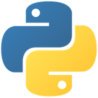

# My solutions to Codewars challenges - programmed in Python. 

-----

### A word of warning

**If you really want to learn Python and improve through the challenges, don't just copy my solutions. You won't learn anything that way!**

-----

My solutions to some [**Codewars challenges**](https://www.codewars.com/users/briskwalker), programmed in **Python**, might not be the most sophisticated, but at least mostly easy to read and understand. However, a few are implemented rather poorly, as I am still a beginner.

-----

See also:

- [My solutions to Codewars challenges - programmed in C](https://github.com/hapepo23/codewars-c-challenges)
- [My solutions to Codewars challenges - programmed in C++](https://github.com/hapepo23/codewars-cplusplus-challenges)
- [My solutions to Codewars challenges - programmed in Pascal](https://github.com/hapepo23/codewars-pascal-challenges)

-----

### !! Security Notice !! 

The code I released here into the public domain may appear in third-party projects. I do not maintain, endorse, or have any affiliation with such projects. Any malicious or deceptive use is unauthorized and should be reported to the hosting platform. 

-----

### List of all challenges I solved in Python

1. [<6 kyu> Find the odd int](https://www.codewars.com/kata/54da5a58ea159efa38000836) - Solution: [find_the_odd_int.py](https://github.com/hapepo23/codewars-python-challenges/blob/master/find_the_odd_int.py)
1. [<8 kyu> Neutralisation](https://www.codewars.com/kata/65128732b5aff40032a3d8f0) - Solution: [neutralisation.py](https://github.com/hapepo23/codewars-python-challenges/blob/master/neutralisation.py)
1. [<8 kyu> You only need one - Beginner](https://www.codewars.com/kata/57cc975ed542d3148f00015b) - Solution: [you_only_need_one.py](https://github.com/hapepo23/codewars-python-challenges/blob/master/you_only_need_one.py)

-----
